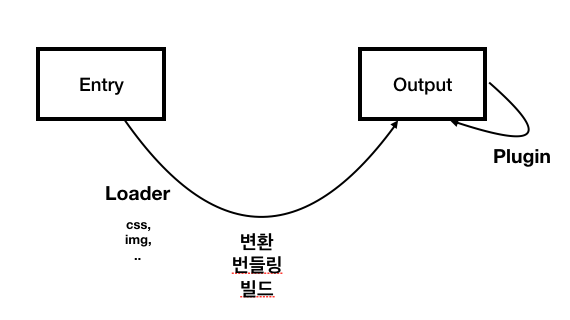

# webpack

### 웹팩이란

모듈 번들러란 웹 애플리케이션을 구성하는 자원(HTML, CSS, Javscript, Images 등)을 **모두 각각의 모듈로 보고 이를 조합해서 병합된 하나의 결과물을 만드는 도구**를 의미

### 모듈 번들링이란 ?

웹 애플리케이션을 구성하는 몇십, 몇백개의 자원들을 하나의 파일로 병합 및 압축 해주는 동작

### 웹팩이 필요한 이유 ?

1. **파일 단위의 자바스크립트 모듈 관리의 필요성**
2. **웹 개발 작업 자동화 도구**
   - 웹 서비스를 개발하고 웹 서버에 배포할 때 HTML,CSS,JS 압축/이미지 압축/CSS 전처리기 변환 이러한 작업해야 했음. 이러한 일들을 자동화 해주는 도구가 필요했었다.
3. **웹 애플리케이션의 빠른 로딩 속도와 높은 성능**
   - 웹 사이트 로딩 속도를 높이기 위해 브라우저에서 서버로 요청하는 파일 숫자를 줄이는 것과 같은 노력을 했음. 이를 위해 웹 태스크 매니저를 이용해 파일을 압축하고 병합하는 작업을 진행했었음.
   - 또 로딩 속도를 높이기 위해 나중에 필요한 자원들 나중에 요청하는 레이지 로딩 등장함.
   - 웹팩은 기본적으로 필요한 자원은 미리 로딩하는 게 아니라 그때 요청하자는 철학을 가지고 있음

### 웹팩으로 해결하려는 문제

- 자바스크립트 변수 유효 범위
  - 웹팩은 해당 문제를 ES6의 Modules 문법과 웹팩의 모듈 번들링으로 해결함
- 브라우저별 HTTP 요청 숫자의 제약
  - TCP 스펙에 따라 브라우저에서 한 번에 서버로 보낼 수 있는 HTTP 요청 숫자는 제약되어 있음. 따라서, HTTP 요청 숫자를 줄이는 것이 웹 애플리케이션의 성능을 높여줄 뿐만 아니라 사용자가 사이트를 조작하는 시간을 앞당겨 줄 수 있음.
  - 웹팩을 이용해 여러 개의 파일을 하나로 합치면 위와 같은 브라우저별 HTTP 요청 숫자 제약을 피할 수 있다.
- 사용하지 않는 코드의 관리
- Dynamic Loading & Lazy Loading 미지원
  - [Require.js](https://requirejs.org/)와 같은 라이브러리를 쓰지 않으면 동적으로 원하는 순간에 모듈을 로딩하는 것이 불가능 했음.
  - 이젠 웹팩의 Code Splitting([https://webpack.kr/guides/code-splitting/](https://webpack.kr/guides/code-splitting/)) 기능을 이용하여 원하는 모듈을 원하는 타이밍에 로딩할 수 있다.
    - Code Splitting
    ```jsx
    Entry Points: entry 설정을 사용하여 코드를 수동으로 분할
    Prevent Duplication: Entry dependencies 또는 SplitChunksPlugin을 사용하여 중복 청크를 제거하고 청크를 분할
    Dynamic Imports: 모듈 내에서 인라인 함수 호출을 통해 코드를 분할
    ```

## 웹팩의 주요 4가지 속성

웹팩의 빌드(파일 변환) 과정을 이해하기 위해서는 아래 4가지 주요 속성에 대해서 알고 있어야 함.



### Entry

- 웹팩에서 웹 자원을 변환하기 위해 필요한 최초 진입점이자 자바스크립트 파일 경로

```jsx
// webpack.config.js
module.exports = {
  entry: "./src/index.js"
};
```

- 엔트리 포인트는 여러개가 될 수도 있음. 이렇게 분리하는 경우 싱글페이지 애플리케이션이 아닌 특정 페이지로 진입했을 때 서버에서 해당 정보를 내려주는 형태의 멀티 페이지 애플리케이션에 적합

```jsx
entry: {
  login: './src/LoginView.js',
  main: './src/MainView.js'
}
```

### Output

- 웹팩을 돌리고 난 결과물의 파일 경로를 의미
- 최소한 filename은 지정해줘야 하며, 일반적으로 path 속성 함께 정의

  - filename : 웹팩으로 빌드한 파일의 이름

    ```jsx
    // filename 에 entry 속성을 포함하는 옵션
    module.exports = {
      output: {
        filename: "[name].bundle.js"
      }
    };

    // filename에 웹팩 내부적으로 사용하는 모듈 ID를 포함하는 옵션
    module.exports = {
      output: {
        filename: "[id].bundle.js"
      }
    };

    // 매 빌드시 마다 고유 해시 값을 붙이는 옵션
    module.exports = {
      output: {
        filename: "[name].[hash].bundle.js"
      }
    };

    // 웹팩의 각 모듈 내용을 기준으로 생생된 해시 값을 붙이는 옵션
    module.exports = {
      output: {
        filename: "[chunkhash].bundle.js"
      }
    };
    ```

  - path : 해당 파일의 경로

```jsx
// webpack.config.js
var path = require("path");

module.exports = {
  output: {
    filename: "bundle.js",
    path: path.resolve(__dirname, "./dist")
  }
};
```

### Loader

- 웹팩이 웹 애플리케이션을 해석할 때 자바스크립트 파일이 아닌 웹 자원(HTML, CSS, Images, 폰트 등)들을 변환할 수 있도록 도와주는 속성
  - 아래 예시는 CSS Loader 적용하는 예시
    - `test` : 로더를 적용할 파일 유형 (일반적으로 정규 표현식 사용)
    - `use` : 해당 파일에 적용할 로더의 이름

```
npm i css-loader -D
```

```jsx
// webpack.config.js
module.exports = {
  entry: "./app.js",
  output: {
    filename: "bundle.js"
  },
  module: {
    rules: [
      {
        test: /\.css$/,
        use: ["css-loader"]
      }
    ]
  }
};
```

- 특정 파일에 대해 여러 개의 로더를 사용하는 경우, 로더 적용 순서 ⇒ **오른쪽에서 왼쪽 순으로 적용됨.**
  - sass-loader(Sass 로더로 전처리(scss 파일을 css 파일로 변환)) → css-loader(웹팩에서 CSS 파일을 인식할 수 있게)

```
module: {
  rules: [
    {
      test: /\.scss$/,
      use: ['css-loader', 'sass-loader']
    }
  ]
}
```

### Plugin

- 웹팩의 기본적인 동작에 추가적인 기능을 제공하는 속성
- **로더**는 **파일을 해석하고 변환하는 과정에 관여**하는 반면, **플러그인**은 **해당 결과물의 형태를 바꾸는 역할**을 한다고 보면됨.
- 아래 예시에서 사용된 플러그인
  - HtmlWebpackPlugin : 웹팩으로 빌드한 결과물로 HTML 파일을 생성해주는 플러그인
  - ProgressPlugin: 웹팩의 빌드 진행율을 표시해주는 플러그인

```jsx
// webpack.config.js
var webpack = require("webpack");
var HtmlWebpackPlugin = require("html-webpack-plugin");

module.exports = {
  plugins: [new HtmlWebpackPlugin(), new webpack.ProgressPlugin()]
};
```

## 웹팩 개발 툴

### Webpack Dev Server

- 개발 과정에 쓰이는 도구
- 웹팩의 빌드 대상 파일이 변경 되었을 때 매번 웹팩 명령어를 실행하지 않아도 코드만 변경하고 저장하면 웹팩으로 빌드한 후 브라우저를 새로고침 해줌.
- 매번 명령어를 치는 시간과 브라우저를 새로 고침하는 시간 뿐만 아니라 웹팩 빌드 시간 또한 줄여주기 때문에 웹팩 기반의 웹 애플리케이션 개발에 필수로 사용
- 웹팩 데브 서버를 실행하여 웹팩 빌드를 하는 경우에는 빌드한 결과물이 파일 탐색기나 프로젝트 폴더에서 보이지 않음.
  - 좀 더 구체적으로 얘기하자면 웹팩 데브 서버로 빌드한 결과물은 메모리에 저장되고 파일로 생성하지는 않기 때문에 컴퓨터 내부적으로는 접근할 수 있지만 사람이 직접 눈으로 보고 파일을 조작할 순 없다.

```
npm i  webpack-dev-server -D
```

```jsx
//package.json
"scripts": {
  "dev": "webpack serve",
  "build": "webpack"
}
```

- 명령어 입력 창에 `npm run dev` 를 입력하여 웹팩 데브 서버 실행, **localhost:9000**에 접속하면 화면 뜸.

```jsx
// webpack.config.js
var path = require("path");
var HtmlWebpackPlugin = require("html-webpack-plugin");

module.exports = {
  mode: "none",
  entry: "./index.js",
  output: {
    filename: "bundle.js",
    path: path.resolve(__dirname, "dist")
  },
  devServer: {
    port: 9000
  },
  plugins: [
    new HtmlWebpackPlugin({
      // index.html 템플릿을 기반으로 빌드 결과물을 추가해줌
      template: "index.html"
    })
  ]
};
```

### 소스 맵

- 배포용으로 빌드한 파일과 원본 파일을 서로 연결시켜주는 기능
- 보통 서버에 배포를 할 때 성능 최적화를 위해 HTML, CSS, JS와 같은 웹 자원들을 압축합니다. 그런데 만약 **압축하여 배포한 파일에서 에러가 난다면 소스 맵을 이용해 배포용 파일의 특정 부분이 원본 소스의 어떤 부분인지 확인하는 것**이다.

```jsx
// webpack.config.js
module.exports = {
  devtool: "cheap-eval-source-map"
};
```

## 그 외

### 웹팩 실행 모드 - mode

- 웹팩 버전 4부터 mode라는 개념 추가됨. 웹팩의 실행 모드가 설정
  - `none` : 모드 설정 안함
  - `development` : 개발 모드
  - `production` : 배포 모드(default)
- 각 실행 모드에 따라 웹팩의 결과물 모습이 달라짐.
  - 개발 모드인 경우에는 개발자들이 좀 더 보기 편하게 웹팩 로그나 결과물이 보여짐.
  - 배포 모드인 경우에는 성능 최적화를 위해 기본적인 파일 압축 등의 빌드 과정이 추가

```jsx
module.exports = {
  mode: "none",
  entry: ""
  // ...
};
```

- 웹팩으로 실제 웹 애플리케이션을 개발할 때는 보통 아래와 같이 2가지 케이스로 구분하여 작업해야 함.

  - 개발할 때 사용할 웹팩 설정
  - 개발이 끝나고 배포할 때 사용할 웹팩 설정
    **웹팩 개발 설정 파일이 1개인 상태에서 실행 모드에 따라 특정 설정을 적용하는 방법**
  - 아래 파일을 보면 객체에서 함수 형식으로 바뀐 것을 볼 수 있다.

  ```jsx
  // webpack.config.js

  // 기존
  // module.exports = {};

  //현재 : module.exports = () => {};
  // env : 환경 변수 의미, 웹팩 실행 시 실행 옵션으로 넘겨 줌
  module.exports = (env) => {
    let entryPath =
      env.mode === "production" ? "./public/index.js" : "./src/index.js";

    return {
      entry: entryPath,
      output: {}
      // ...
    };
  };
  ```

  ```jsx
  // package.json
  {
    "build": "webpack",
    "development": "npm run build --env mode=development",
    "production": "npm run build --env mode=production"
  }
  ```

### Webpack Merge

- 단어 그대로 여러 개의 웹팩 설정 파일을 하나로 병합해주는 라이브러리, 일반적으로 웹 애플리케이션을 제작할 때 웹팩 설정을 개발용과 배포용으로 나누어 적용
- 실행할 때 env 조건문으로 설정을 구분을 할 수 있으나, 실제로는 파일을 아예 나누는 게 더 권장하는 방식으로 이러한 상황에 사용함
- **웹팩 머지를 효율적으로 사용하는 방법**

  - 개발용과 배포용 설정 파일에서 공통으로 쓰이는 부분을 먼저 분리하는 것

    - 파일 체계

    ```
    webpack.common.js
    webpack.dev.js
    webpack.prod.js
    ```

    - webpack.common.js
      - 공통 설정 파일에는 엔트리, 아웃풋, 플러그인과 같이 실행 모드에 관계 없이 항상 들어가야 하는 코드를 추가

    ```jsx
    // webpack.common.js
    module.exports = {
      entry: "./src/index.js",
      output: {
        filename: "bundle.js"
      },
      plugins: [new CleanWebpackPlugin(), new HtmlWebpackPlugin()]
    };
    ```

    - webpack.common.js
      - 개발용 설정 파일에는 개발자 도구나 webpack dev server와 같은 설정을 추가
      - 그리고 `webpack-merge` 라이브러리를 설치 및 로딩하고 나서 웹팩 공통 설정 파일인 `webpack.common.js` 파일을 로딩해서 같이 병합

    ```jsx
    // webpack.dev.js
    const { merge } = require("webpack-merge");
    const common = require("./webpack.common.js");

    module.exports = merge(common, {
      mode: "development",
      devtool: "inline-source-map",
      devServer: { contentBase: "./dist" }
    });
    ```

    - webpack.prod.js
      - 배포용 설정 파일에는 배포하기 전 웹 리소스 최적화를 위한 설정들을 추가

    ```jsx
    // webpack.prod.js
    const { merge } = require("webpack-merge");
    const common = require("./webpack.common.js");

    module.exports = merge(common, {
      mode: "production"
    });
    ```
